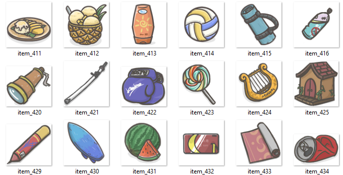
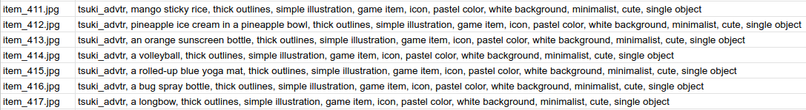

# Inference worker

## Table of content
1. [Introduction](#1-introduction)
2. [Overall architecture](#2-overall-architecture)
3. [Project structure](#3-project-structure)
4. [Model training Details](#4-model-training-details)
- 4.1. [Data preparation](#4-1-data-preparation)
- 4.2. [LoRA Fine-tuning](#4-2-lora-fine--tuning)
5. [Implementing Details](#5-implementing-details)
- 5.1. [VM initial setup](#5-1-vm-initial-setup)
- 5.2. [Running the worker](#5-2-running-the-worker)
6. [Monitoring setup](#6-monitoring-setup)
- 6.1 [Logging with ELK stack - Filebeat setup](#6-1-logging-with-elk-stack-filebeat---setup)

## 1. Introduction
As a key component of the Item Generation System, this inference worker is designed to consume messages from a RabbitMQ queue. It generates images based on the provided prompts and parameters, leveraging a fine-tuned LoRA with Stable Diffusion 1.5 model. 

## 2. Overall architecture
<p align="center">
  
</p>

**Main workflows:**
- Message Consumption: the inference worker establishes a persistent connection to RabbitMQ, listening for incoming generation jobs on a dedicated queue.
- Inference and Image Generation: upon receiving a message, the worker uses the information (prompt, negative prompt, guidance scale, etc.) to generate image with the fine-tuned LoRA model.
- Status Updates and Storage: throughout the process, the worker communicates with an API Gateway (deployed on GKE) to update the job status in a Cloud SQL database:
  + When a job begins, its status is set to "Processing".
  + Upon successful completion, the status is updated to "Completed". The final image is uploaded to Google Cloud Storage (GCS), and its public URL is save to the database.
  + If an error occurs, the status is marked as "failed".

## 3. Project structure
```
.
├── data_preparation      - Scripts for data crawling, processing and captioning
├── images                - Sample images
├── models                - Folder to save the downloaded SD1.5 model and fine-tuned LoRA
├── Dockerfile            - Defines the Docker image for the inference worker image
├── download_models.py    - Script to download the base SD1.5 model and fine-tuned LoRA weights
├── export_env   .sh      - Script to export environment variables
├── gcs_key.json          - GCS service account key
├── inference.py          - The core application logic for the worker
├── lora-fine-tune.ipynb  - Jupyter notebook for model fine-tuning
├── requirements.txt      - Python dependencies
└── setup_vm.sh           - Script to setup VM
```


## 4. Model training Details
The core objective of the model training phase was to fine-tune a Stable Diffusion 1.5 model using LoRA. The goal was to enable the model to generate items that emulate the distinct art style of the Tsuki Adventure game assets (cute, hand-drawn, pastel colors, thick outlines, etc.)

### 4.1 Data preparation: Image crawling, processing and captioning
There are 3 main steps in this phase:
1. Image crawling
   1028 uniqe game asset images were scraped from the official Tsuki Adventure Fandom Wiki (https://tsuki-adventure.fandom.com/wiki/Items). This process was automated using python scipts leveraging Beautiful Soup and Selenium.

2. Image processing
   Images are converted to white background in this process. Below are some examples from the processed dataset.
   <p align="center">
   
   </p>

3. Image captioning: Each image was then captioned to provide textual descriptions for the model. A two-stage captioning process was employed:
   - Automated captioning: initial captions were generated using the Google Gemini API.
   - Manual refinement: These automated captions were then manually reviewed and refined to ensure accuracy, consistency and detail.

   All captions adhere to a predefined structure to optimize the LoRA training, including a trigger word "tsuki_advtr", a description of the object and keywords defining the style.

   <p align="center">
   
   </p>

### 4.2 LoRA Fine-tuning
The fine-tuning process was conducted within a Kaggle Notebook environment, utilizing a free T4 GPU instance.
   - Experiment tracking: Wandb was integrated for experiment tracking, which logging hyperparameters, training metrics, and final model artifacts.
   - Configuration: all settings and implementation details are in lora-fine-tune.ipynb notebook.

Example generation result:
   - prompt: "tsuki_advtr, a samoyed dog smiling, white background, thick outlines, pastel color, cartoon style, hand-drawn, 2D icon, game item, 2D game - style, minimalist", num_inference_steps: 50, guidance_scale: 7.5, seed: 50

   <p align="center">
   
   </p>


## 5. Implementing Details
To serve the fine-tuned model, the inference worker is deployed on a cloud VM with GPU acceleration.

### 5.1 VM initial setup
- First, rent VM from vast.ai provider with at least, the following specifications:
   + Template: Ubuntu VM 22.04 (**!Remember to add port 9100 TCP when creating template**)
   + GPU: NVIDIA RTX 3060
   + CUDA version: >= 11.8

- After accessed VM through ssh, create ```setup_vm.sh``` file with the same content in this repository to setup and install needed dependencies (essential packages, CUDA Toolkit 11.8, Anaconda) automatically:

   ```
   bash setup_vm.sh
   ```

- Open new terminal and install uv:
   ```
   pip install uv
   ```

### 5.2 Running the Inference worker

1. Clone the repository:
   ```
   git clone https://github.com/hienntt19/game-item-generation.git

   cd game-item-generation
   ```

2. Setup the python environment:
   ```
   uv init

   uv venv 

   source .venv/bin/activate

   uv pip install -r requirements.txt
   ```

3. Configure environment variables:
   Update export_env.sh with your own credentials then run:
   ```
   source export_env.sh
   ```
4. Create Google Cloud Storage bucket and Service account key:
   - Go to **Google Cloud Console > IAM & Admin > Service Accounts** and generate new key json file with GCS service account, named gcs-key.json and put into this repository.

5. Download models:
   Run the download script to download Stable Diffusion 1.5 and fine-tuned LoRA:
   ```
   python download_models.py
   ```
   The downloaded models are placed in models/ directory.


There are 2 ways to run the inference worker:
- Running locally
   Start the worker directly:
   ```
   python inference.py
   ```

- Using Docker
   + Pull docker image from dockerhub:
   ```
   docker pull sheehan19/inference-worker:latest
   ```

   + Run the docker container:
   ```
   docker run \
      --restart always \
      --gpus all \
      -v /home/user/game-item-generation/models:/app/models \
      -v /home/user/game-item-generation/gcs-key.json:/app/gcs-key.json \
      --env-file ./.env \
      --log-driver json-file \
      --log-opt max-size=50m \
      --log-opt max-file=5 \
      --name my-inference-worker \
      sheehan19/inference-worker:latest
   ```

## 6. Monitoring setup
### 6.1 Logging with ELK stack - Filebeat setup
- Install Filebeat:
```
wget -qO - https://artifacts.elastic.co/GPG-KEY-elasticsearch | sudo gpg --dearmor -o /usr/share/keyrings/elastic-keyring.gpg

sudo apt-get install apt-transport-https
echo "deb [signed-by=/usr/share/keyrings/elastic-keyring.gpg] https://artifacts.elastic.co/packages/8.x/apt stable main" | sudo tee /etc/apt/sources.list.d/elastic-8.x.list

sudo apt-get update && sudo apt-get install filebeat

```

- Config /etc/filebeat/filebeat.yml with the same content in filebeat_config/filebeat.yml, remember to change config corresponded to GKE cluster config

- Check Filebeat:

```
sudo filebeat test config -e
sudo filebeat test output -e

```

- Start Filebeat:

```
sudo systemctl enable filebeat
sudo systemctl start filebeat

sudo systemctl status filebeat
```

### 6.2 Metrics with Prometheus+Grafana - Node Exporter setup
- Install Node Exporter:
```
wget https://github.com/prometheus/node_exporter/releases/download/v1.7.0/node_exporter-1.7.0.linux-amd64.tar.gz
tar xvfz node_exporter-1.7.0.linux-amd64.tar.gz
cd node_exporter-1.7.0.linux-amd64

```

- Run Node Exporter with `./node_exporter`